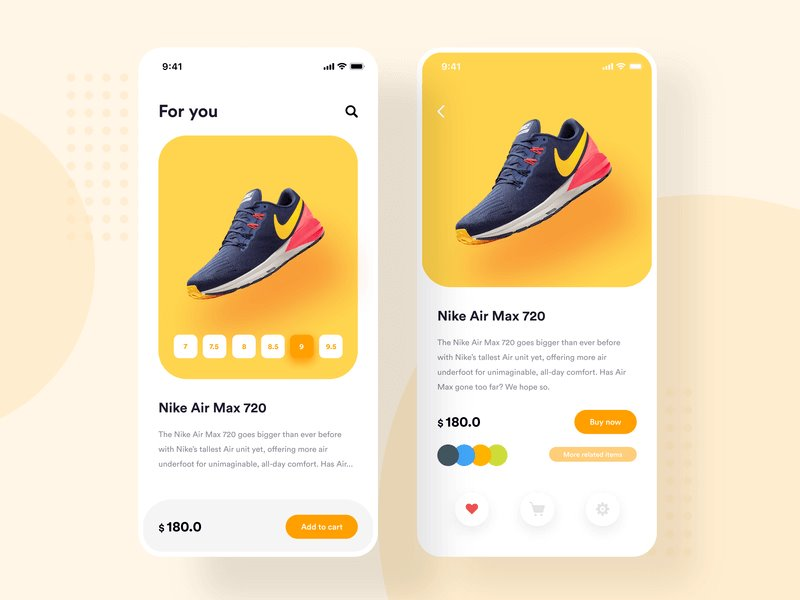

# nike-shoes
Aplicación mobile desarrollada en Flutter la cual permite seleccionar el talle de una zapatilla y su cambio de colores en tiempo real.
 
 # Getting Started
 Para instalar el proyecto se debe ejecutar el siguiente comando en la carpeta raíz del proyecto
 ```
  flutter packages get
```

# Paquetes utilizados

- <a href="https://pub.dev/packages/animate_do" target="_blank">Animate_do</a>
- <a href="https://pub.dev/packages/provider" target="_blank">Provider</a>

# Screenshots
El proyecto es resultado del curso de Fernando Herrera en Udemy (https://www.udemy.com/course/flutter-disenos-y-animaciones/).
El diseño fue inspirado en el siguiente UI.



## App en funcionamiento


